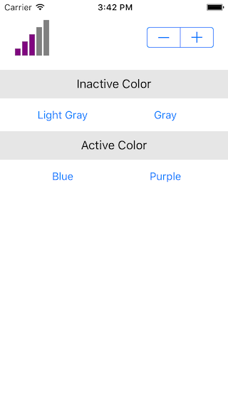

# HLSignalView

[](https://travis-ci.org/hermanliang/HLSignalView)
[](http://cocoapods.org/pods/HLSignalView)
[](http://cocoapods.org/pods/HLSignalView)
[](http://cocoapods.org/pods/HLSignalView)



## Example

To run the example project, clone the repo, and run `pod install` from the Example directory first.

## Requirements

## Installation

HLSignalView is available through [CocoaPods](http://cocoapods.org). To install
it, simply add the following line to your Podfile:

```ruby
pod "HLSignalView"
```

### Xcode 8

Add following at the bottom of your Podfile

```ruby
post_install do |installer|
  installer.pods_project.targets.each do |target|
    target.build_configurations.each do |config|
      config.build_settings['SWIFT_VERSION'] = '2.3' # or '3.0'
    end
  end
end
```

## Usage

### Storyboard

1. Add an `UIView` onto any view controller of storyboard
2. Edit `Identity Inspector`: Custom Class
  - Class: HLSignalView
  - Module: HLSignalView
3. Edit `Attributes Inspector`:
  - Intensity: initial signal intensity (0 - 5)
  - Color Inactive: initial inactive color
  - Color Active: initial active color

### Swift File

```swift
import HLSignalView
```

### HLSignalView Attributes

- intensity: signal intensity (0 - 5)
- colorInactive: inactive color of the signal view
- colorActive: active color of the signal view

## Author

Herman Liang, hermanliang80@gmail.com

## License

HLSignalView is available under the MIT license. See the LICENSE file for more info.
